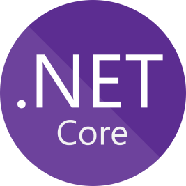
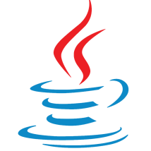

### Ethan May - Software Developer
Hello! Nice to meet you. A little bit about me: I've been pursuing software development since early high school and it's become quite a passion. I'm continuing my journey with Boise State University, pursuing a Bachelors in Computer Science. I also recently graduated from CodeWorks Bootcamp in Boise, where I earned a certification in Full Stack Software Development.

---

---

### Professional Resources:
- [Portfolio](https://ethanmmay.github.io/)  
- [Elevator Pitch](https://docs.google.com/document/d/1V0MX5obxrq0h-2C6lDp3zmpOArFCoQXqPT5GOhdpnCQ/edit?usp=sharing)  
- [Stylized Resume](https://github.com/ethanmmay/ethanmmay/blob/main/Job%20Search/Week%205%20BCW%20Homework/Ethan's%202021%20Resume%20(3).pdf)  
- [LinkedIn](https://www.linkedin.com/in/ethanmmay/)

### Fun Websites:
- [Hacker Clicker](https://ethanmmay.github.io/checkpoint-2)  
- [Balloon Pop](https://ethanmmay.github.io/balloon-pop)

--- 

| Languages And Tools |
| :---------------------: |
|      |
|       |
|        |
|   
