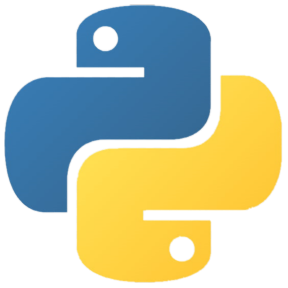
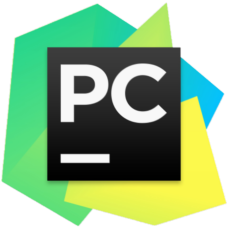
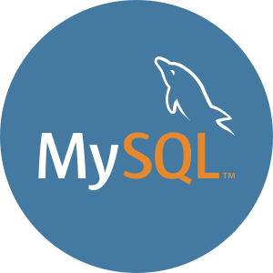
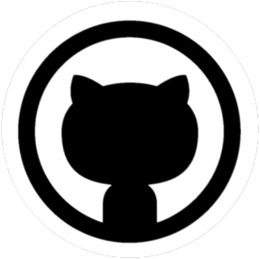

### Ethan May - Software Developer
Hello! I'm Ethan May, a Software Developer in Meridian, Idaho. I've been pursuing software development since early in high school and I'm continuing my journey with Boise State University, pursuing a Bachelors in Computer Science.

I'm excited to learn more and secure a career in building, training and perfecting of neural networks.

### Available Websites:

https://ethanmmay.github.io/balloon-pop/

https://ethanmmay.github.io/contacts-challenge/

https://ethanmmay.github.io/moody-kittens/

### Languages and Tools:

