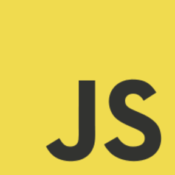

### Ethan May - Software Developer
Hello! I'm Ethan May, a Software Developer in Meridian, Idaho.   I've been pursuing software development since early high school   and it's become quite a passion.
I'm continuing my journey with   Boise State University, pursuing a Bachelors in Computer Science,   as well as attending Boise Code Works, where I am learning   more practical development skills.

---

### Available Websites:

https://ethanmmay.github.io/blog/         

https://ethanmmay.github.io/checkpoint-2/          

https://ethanmmay.github.io/balloon-pop/              

---

--- 

| Languages And Tools |
| :---------------------: |
|      |
|       |
|       |
